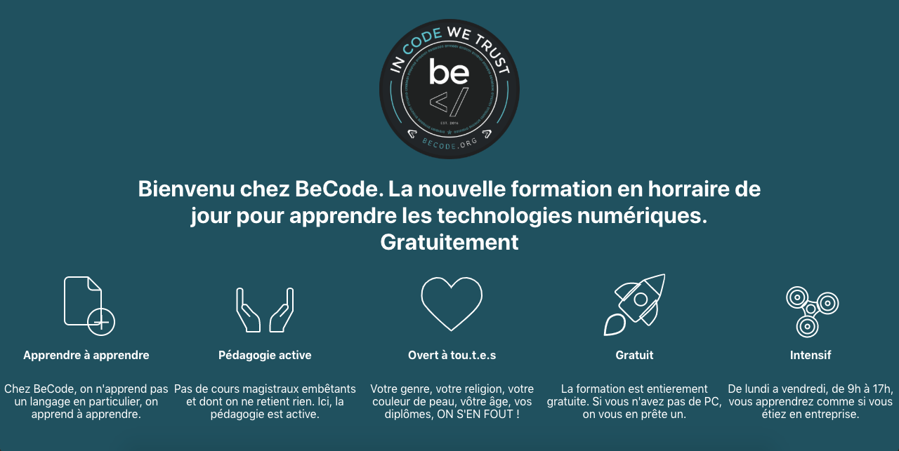
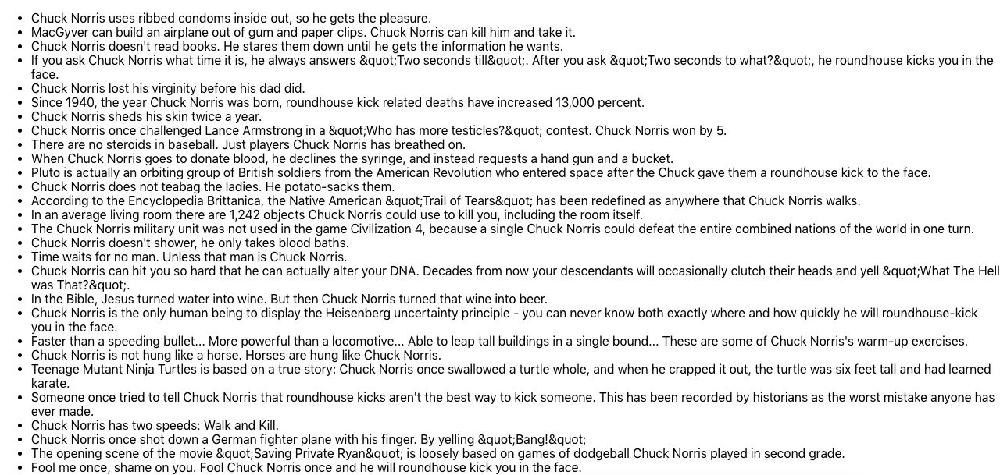

# React
Initiation a React

## Landing page

Pour le premier exos j'ai du reconstituer la page d'entree de [BeCode.org](https://becode.org/webdev/index.html)

Si vous souhaiter voir le site sur votre navigateur:

* Cloner le repo

* cd try_it/

* npm start

## Les hooks

Dans cette exercices nous fesont un appel api et utilisont 'useEffect' et 'useState' afin de parcourire l'api et y reprendre les blague de Chuck Norris afin de les afficher 

Si vous souhaiter voir le site sur votre navigateur:

* Cloner le repo

* cd hooks/

* npm start